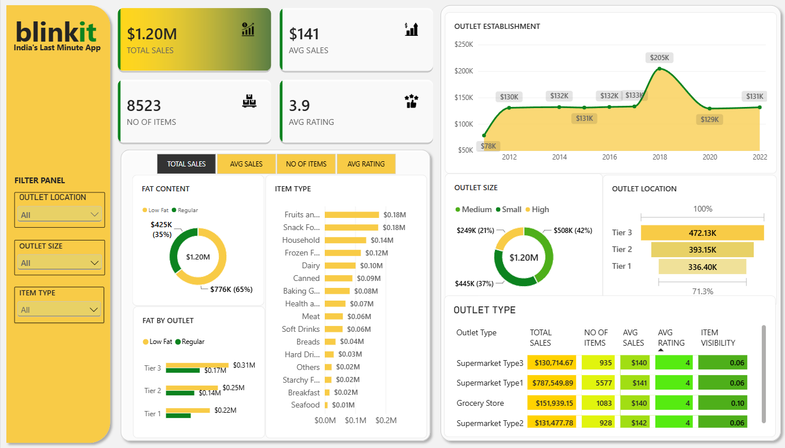

# Blinkit Sales Analysis Dashboard | Power BI

## 📊 Project Overview

This project presents an interactive sales analysis dashboard built using Microsoft Power BI.

The dashboard analyzes Blinkit grocery sales data to provide insights into sales performance, product categories, outlet characteristics, outlet locations, and customer ratings.

The project focuses on transforming raw sales data into an interactive business intelligence dashboard that can support data-driven analysis.

---

## 🎯 Business Requirements

The dashboard was developed to analyze the following key business metrics:

- Total Sales
- Average Sales
- Number of Items
- Average Rating

The analysis also focuses on understanding sales performance across:

- Fat Content
- Item Type
- Outlet Type
- Outlet Size
- Outlet Location
- Outlet Establishment Year

---

## 🛠️ Tools & Technologies

- **Power BI Desktop**
- **Power Query**
- **DAX**
- **Microsoft Excel**
- **Data Cleaning & Transformation**
- **Data Modeling**
- **Data Visualization**

---

## 📌 Key Performance Indicators

| KPI | Value |
|---|---:|
| Total Sales | $1.20M |
| Average Sales | $141 |
| Number of Items | 8,523 |
| Average Rating | 3.9 |

---

## 📈 Dashboard Features

### Interactive Filters

The dashboard includes interactive slicers for:

- Outlet Location
- Outlet Size
- Item Type

These filters allow users to dynamically explore different segments of the sales data.

### Sales Analysis

The dashboard provides visual analysis of:

- Total Sales by Fat Content
- Total Sales by Item Type
- Fat Content by Outlet
- Total Sales by Outlet Establishment
- Sales by Outlet Size
- Sales by Outlet Location
- Key metrics by Outlet Type

### KPI Cards

The dashboard provides a quick overview of:

- Total Sales
- Average Sales
- Number of Items
- Average Rating

---

## 🔍 Key Insights

Based on the dashboard analysis:

- Total sales across the analyzed outlets are approximately **$1.20 million**.
- The dataset contains **8,523 items**.
- The overall average sales value is approximately **$141**.
- The average customer rating is approximately **3.9**.
- **Regular-fat products** contribute a larger share of total sales than low-fat products in the dashboard.
- **Tier 3 outlets** contribute the highest sales among the three outlet-location tiers.
- **Medium-sized outlets** account for the largest share of sales among the outlet-size categories.
- Sales vary across outlet establishment years, with a notable peak around **2018** in the displayed trend.
- The dashboard allows outlet-level and product-level performance to be explored interactively using slicers.

---

## 🧹 Data Preparation

The raw dataset was prepared using Power Query before building the dashboard.

The data preparation process included:

- Reviewing the source data
- Checking data quality
- Cleaning and transforming fields
- Handling data inconsistencies
- Preparing columns for analysis
- Creating a suitable data structure for Power BI

---

## 🧮 DAX & Data Modeling

DAX measures were used to calculate the major business metrics displayed in the dashboard.

The project also involved creating a Power BI data model suitable for analyzing sales across different product and outlet dimensions.

Key calculations include:

- Total Sales
- Average Sales
- Number of Items
- Average Rating

---

## 🖼️ Dashboard Preview



---

## 📁 Project Files

```text
Blinkit-PowerBI-Dashboard/
│
├── Blinkit_Sales_Dashboard.pbix
├── README.md
└── images/
    └── dashboard.png
